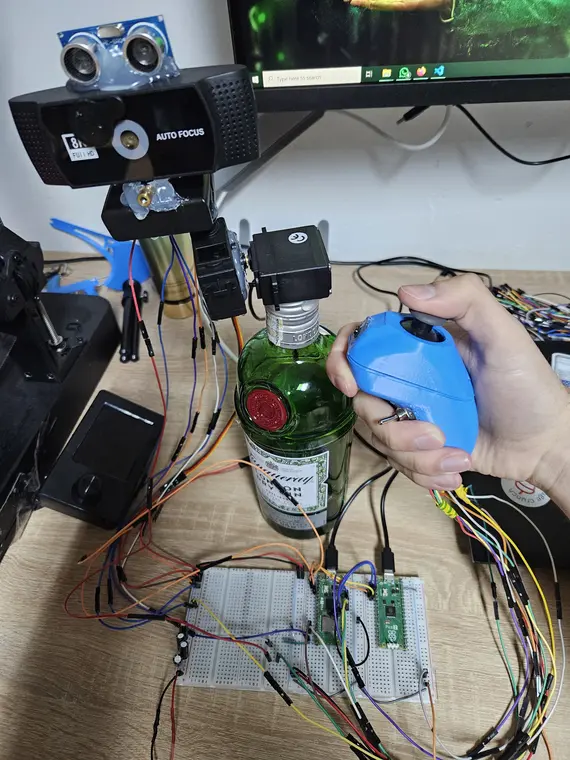
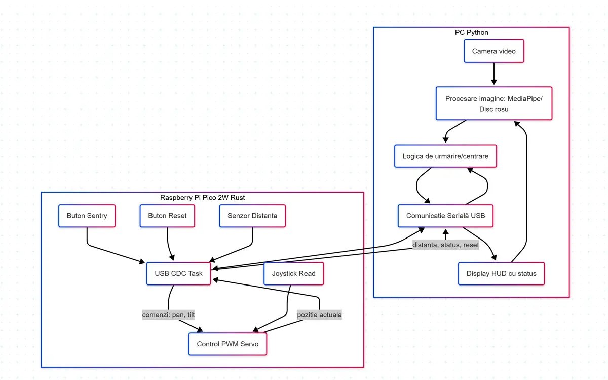

# Focalizare Unificata cu Tintire Autonomata Inteligenta  
A turret that tracks and targets people using computer vision and a laser.

:::info 

**Author**: Andrei-Valerian Andreescu \
**GitHub Project Link**: [Github](https://github.com/UPB-PMRust-Students/proiect-DrescoAV.git)

:::

## Description

This project is about building a simple automated turret that can detect and follow people with a camera and aim a laser at them in real-time. The user will be able to set a target (for example a red circle or a yellow t-shirt), and the turret will lock onto it and track it.


## Motivation

I got the idea from the game *Rust*, where you can build autoturrets that shoot at players who get too close to your base. I thought it would be cool to try and make something similar in real life, but just using a laser for now.

## Architecture 

The system has two main parts:

- **Vision + Targeting (Python)**: A Python script runs object detection (YOLO) on a laptop and identifies the target based on color or shape. It sends coordinates to the turret controller.
- **Control (Rust)**: A Raspberry Pi 2W runs a Rust program that controls two servo motors — one for horizontal rotation, one for vertical — and points the camera and laser to track the target.
- The camera and laser are mounted on the same platform, so they move together.


## An almost final photo of the project


## Software Diagram



## Log

<!-- write your progress here every week -->

### Week 5 - 11 May
Researched similar turret systems for inspiration and finalized the design plan. Ordered all necessary hardware components based on system requirements and constraints.

### Week 12 - 18 May
Received the components and assembled the mechanical structure, including the servo mounts, camera bracket, and laser holder. Verified that all parts fit together and are functional.

### Week 19 - 25 May
Implemented the full software system. The Rust side uses Embassy for async servo control and joystick input, while Python handles vision using OpenCV and MediaPipe. Communication between the two is done over USB serial for real-time turret tracking.

## Hardware

A list of the main hardware components used in the project:

- **Raspberry Pi Pico 2W** – Acts as the main controller for servo movement and USB communication.
- **2x SG90 Servo Motors** – Control the pan and tilt movement of the turret.
- **HC-SR04 Ultrasonic Sensor** – Measures the distance to nearby obstacles for HUD and behavior decisions.
- **Analog Joystick Module** – Used for manual control of turret direction
- **USB Camera** – Captures video feed for real-time object detection.
- **Laser Pointer** – Visually highlights the target being tracked.
- **Breadboard + Jumper Wires** – For quick and modular connections.
- **5V Power Supply** – Powers the servo motors reliably.

### Schematics


### Bill of Materials

<!-- Fill out this table with all the hardware components that you might need.

The format is 
```
| [Device](link://to/device) | This is used ... | [price](link://to/store) |

```

-->

| Device | Usage | Price |
|--------|--------|-------|
| [2 × Raspberry Pi Pico 2 W](https://www.raspberrypi.com/documentation/microcontrollers/pico-series.html) | Microcontrollers with Wi-Fi and Bluetooth for sensor processing and motor control | [40 RON each](https://www.optimusdigital.ro/ro/placi-raspberry-pi/13327-raspberry-pi-pico-2-w.html) |
| [2 × SG90 Micro Servo Motor](https://components101.com/sites/default/files/component_datasheet/MG995-Servo-Motor-Datasheet.pdf) | OX and OY camera movement | [39 RON each](https://www.emag.ro/motor-servo-mg995-11kg-180grade-ai209-s296/pd/DZSHBRBBM/) |
| [1 x 5V 3A Source](https://www.emag.ro/sursa-de-alimentare-pentru-camere-de-supraveghere-universal-ac-dc-5v-3a-negru-q-l5v/pd/DCHP1DYBM/) | Provides DC for every component | [23 RON](https://www.emag.ro/sursa-de-alimentare-pentru-camere-de-supraveghere-universal-ac-dc-5v-3a-negru-q-l5v/pd/DCHP1DYBM/) |
| [Jumper Wires](https://www.electronicwings.com/components/male-to-male-jumper-wire/1/datasheet) | This is used for wiring connections between modules and breadboard circuits | [23 RON](https://www.optimusdigital.ro/en/wires-with-connectors/12475-male-to-male-jumper-wires-40-pin-40cm.html) |
| [Breadboard](https://www.optimusdigital.ro/en/breadboards/13244-breadboard-175-x-67-x-9-mm.html) | Rapid prototyping without soldering | [15 RON](https://www.optimusdigital.ro/en/breadboards/13244-breadboard-175-x-67-x-9-mm.html) |
| [Resistors](https://www.plusivo.com/electronics-kit/117-plusivo-resistor-kit-250-pcs.html) | Used in voltage dividers | [12 RON](https://www.optimusdigital.ro/en/resistors/10928-250-pcs-plusivo-resistor-kit.html) |


## Software

## Software

| Library      | Description                    | Usage                                                       |
|--------------|--------------------------------|-------------------------------------------------------------|
| OpenCV       | Computer vision library        | Used for red circle detection and video stream processing   |
| MediaPipe    | ML solution from Google        | Used for hand landmark detection                           |
| NumPy        | Numerical operations           | Used for vectorized math like clipping and error computation |
| PySerial     | Serial communication           | Communicates with Rust firmware over USB                   |
| Keyboard     | Keypress handling              | Mode switching and reset from keyboard                     |
| Threading    | Python threads                 | Runs serial reading in a background thread                 |
| Embassy      | Async embedded framework       | Rust-based async control over servos and peripherals        |
| Embassy-RP   | HAL for Raspberry Pi Pico      | Controls PWM, GPIO, ADC for joystick and servos            |
| Embassy-USB  | USB CDC for Rust               | Sends position commands and status updates over USB        |
| Fixed        | Fixed-point math               | Controls PWM signal precision                              |
| Static-Cell  | Memory allocation              | Used for USB buffer initialization and CDC state           |
| Panic-Probe  | Error handler for embedded     | Allows USB debugging with probe-run                        |
| Heapless     | Lightweight containers         | Used for generating serial strings from float measurements |

## Links

- [PMRust - UPB](https://pmrust.pages.upb.ro/)
- [Rust Game - Facepunch](https://rust.facepunch.com/)
